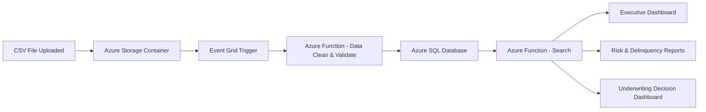

# **Use Case: Credit Risk & Loan Portfolio Reporting**

### **Overview**

A financial institution wants to build an automated reporting and analytics solution using the data captured in the **credit_test.csv** file. The information represents customer loan applications and their associated credit-risk attributes. Business stakeholders—Risk Officers, Loan Underwriters, Data Analysts, and Executives—need dashboards to evaluate risk exposure, customer credit behavior, loan performance, and lending opportunities.

---

# **1. Business Problem**

The bank processes thousands of loan applications monthly. However:

* Risk exposure cannot be monitored in real-time.
* Loan officers manually review data from spreadsheets.
* Executives lack trend insights across loan amounts, credit scores, and defaults.
* No early-warning signals exist for high-risk borrowers.

This results in inefficient decision-making, increased loan defaults, and missed opportunities for optimized credit policies.

---

# **2. Purpose of Reporting Solution**

The reporting solution enables:

### ✔ **Credit Risk Monitoring**

Identify customers with low credit scores, high DTI ratios, or increasing delinquency patterns.

### ✔ **Portfolio Performance Insights**

Track loan distribution, loan amounts, and credit balance trends.

### ✔ **Customer Segmentation**

Segment customers by income, employment stability, home ownership, or loan purpose.

### ✔ **Operational Efficiency**

Replace manual Excel workflows with automated dashboards and Data Refresh pipelines.

---

# **3. Key Metrics Generated from the CSV**

The dataset enables the following calculated KPIs:

### **Risk Metrics**

* Average Credit Score by segment
* Debt-to-Income Ratio (DTI)
* Borrower delinquency indicators (Number of Credit Problems, Bankruptcies, Tax Liens)

### **Portfolio Metrics**

* Total loan amount
* Loan amount by loan purpose (Debt Consolidation, Personal, Home Improvement, etc.)
* Loan distribution by Term (Short Term vs. Long Term)
* Credit utilization = Current_Credit_Balance / Maximum_Open_Credit

### **Customer Metrics**

* Income tiers
* Age of customer job history
* Home ownership type
* Monthly debt burden

---

# **4. Reporting Use Cases**

## **Use Case A — Executive Credit Portfolio Dashboard**

**Audience:** CIO, CFO, Chief Risk Officer
**Purpose:** Assess financial health of the loan portfolio.

### Dashboard Elements:

* Total Loan Portfolio Value
* High-Risk Borrowers Count
* Avg. Credit Score Trend
* Loan Purpose Breakdown - Pie Chart
* Home Ownership Distribution
* Loan Term by Customer Segment

---

## **Use Case B — Loan Underwriting Decision Dashboard**

**Audience:** Underwriters, Credit Officers
**Purpose:** Speed up loan approval/rejection.

### Features:

* Automated risk scoring (derived from CreditScore, DTI, bankruptcies)
* Recommendation: Approve / Review / Deny
* Customer financial snapshot:

  * Monthly Debt
  * Annual Income
  * Job tenure
  * Open accounts
* Risk trend visualization for similar applicants

---

## **Use Case C — Early Warning Delinquency Reporting**

**Audience:** Risk Analysts, Collections Team
**Purpose:** Predict and prevent loan defaults.

### Key Indicators:

* Number_of_Credit_Problems
* Bankruptcies
* Tax Liens
* High credit utilization ratio
* Low credit score (< 600)

### Outcomes:

* Generate "High-Risk Customer Watchlist"
* Trigger notifications for proactive outreach

---

## **Use Case D — Regulatory & Compliance Reporting**

**Audience:** Compliance Officers
**Purpose:** Demonstrate fair lending, income verification, and credit scoring accuracy.

### Reports:

* Income vs. Loan Amount compliance checks
* Fair Credit Lending score distribution
* High-debt customers flagged for review

---

# **5. Technical Implementation**

### **Data Source:**

The CSV becomes an ingestion source for a reporting pipeline.

### **Architecture Recommended (Azure):**

* **Azure Storage → ADLS Gen2** (CSV upload)
* **Azure Data Factory** (Automated ingestion)
* **Azure SQL / Synapse** (Cleaned and modeled data)
* **Power BI** dashboards (Interactive reporting)
* **Event Grid triggers** for new file uploads
* **Azure Functions for DTI or Risk Score calculations**

---

# **6. Sample Data Insights (from your CSV)**

Here are examples extracted from your uploaded CSV sample:

| Metric                   | Sample Value       |
| ------------------------ | ------------------ |
| Avg Credit Score         | ~732               |
| Max Loan Amount          | 611,314            |
| Avg Annual Income        | ~1.3M              |
| Most Common Loan Purpose | Debt Consolidation |
| Most Home Ownership Type | Home Mortgage      |

---

# **7. Mermaid Diagram — Reporting Flow**



---

# **8. Deliverables Produced by the Reporting System**

### **Dashboards:**

* Portfolio Overview Dashboard
* Credit Quality Heat Map
* Delinquency & Bankruptcy Early Warning Dashboard
* Loan Purpose & Income Segmentation

### **Reports:**

* Monthly Risk Review
* Credit Score Distribution
* Customer Financial Stability Report
* Loan Trend & Forecasting (Power BI forecasting models)

---

Below are **four SQL Server stored procedures** that compute the chart data directly from your **credit_test.csv–based SQL table**.
These procedures return the aggregated result sets needed by your REST API endpoints to populate the dashboard charts.

---

# ✅ **Assumptions**

Your table name:

```sql
CreditApplication
```

Columns (as seen in your CSV):

* CurrentLoanAmount
* Term
* Purpose
* CreditScore
* Home_Ownership
* … (other fields)

---
# ✅ **SQL Table: CreditApplication (All Columns NVARCHAR(100))**

```sql
CREATE TABLE dbo.CreditApplication
(
    LoanID                         NVARCHAR(100) NULL,
    CustomerID                     NVARCHAR(100) NULL,
    CurrentLoanAmount              NVARCHAR(100) NULL,
    Term                           NVARCHAR(100) NULL,
    CreditScore                    NVARCHAR(100) NULL,
    AnnualIncome                   NVARCHAR(100) NULL,
    Years_in_current_job           NVARCHAR(100) NULL,
    Home_Ownership                 NVARCHAR(100) NULL,
    Purpose                        NVARCHAR(100) NULL,
    Monthly_Debt                   NVARCHAR(100) NULL,
    Years_of_Credit_History        NVARCHAR(100) NULL,
    Months_since_last_delinquent   NVARCHAR(100) NULL,
    Number_of_Open_Accounts        NVARCHAR(100) NULL,
    Number_of_Credit_Problems      NVARCHAR(100) NULL,
    Current_Credit_Balance         NVARCHAR(100) NULL,
    Maximum_Open_Credit            NVARCHAR(100) NULL,
    Bankruptcies                   NVARCHAR(100) NULL,
    Tax_Liens                      NVARCHAR(100) NULL
);
```


# ✅ 1️⃣ Stored Procedure — **Loan Amount by Term**

Returns total dollar amount of loans grouped by **Short Term** and **Long Term**.

```sql
CREATE OR ALTER PROCEDURE sp_LoanTermSummary
AS
BEGIN
    SET NOCOUNT ON;

    SELECT 
        Term AS LoanTerm,
        SUM(CurrentLoanAmount) AS TotalLoanAmount
    FROM CreditApplication
    GROUP BY Term
    ORDER BY TotalLoanAmount DESC;
END;
```

### Sample Output

| LoanTerm   | TotalLoanAmount |
| ---------- | --------------- |
| Short Term | 3,200,000       |
| Long Term  | 1,400,000       |

---

# ✅ 2️⃣ Stored Procedure — **Loan Purpose Distribution**

Returns counts of each loan purpose and optional percentages.

```sql
CREATE   PROCEDURE sp_LoanPurposeSummary
AS
BEGIN
    SET NOCOUNT ON;

    SELECT 
        Purpose,
        COUNT(*) AS TotalApplications,
        CAST(COUNT(*) * 100.0 / SUM(COUNT(*)) OVER() AS DECIMAL(5,2)) 
            AS PercentageShare
    FROM CreditApplication
    GROUP BY Purpose
    ORDER BY TotalApplications DESC;
END;
```

### Sample Output

| Purpose            | TotalApplications | PercentageShare |
| ------------------ | ----------------- | --------------- |
| Debt Consolidation | 480               | 48.00           |
| Personal           | 220               | 22.00           |
| Home Improvement   | 150               | 15.00           |
| Other              | 150               | 15.00           |

---

# ✅ 3️⃣ Stored Procedure — **Credit Score Distribution (Histogram Groups)**

This creates buckets such as:

* 500–579
* 580–619
* 620–659
* 660–719
* 720–780

You can adjust buckets as needed.

```sql
CREATE   PROCEDURE sp_CreditScoreSummary
AS
BEGIN
    SET NOCOUNT ON;

    SELECT 
        CASE 
            WHEN CreditScore BETWEEN 500 AND 579 THEN '500-579'
            WHEN CreditScore BETWEEN 580 AND 619 THEN '580-619'
            WHEN CreditScore BETWEEN 620 AND 659 THEN '620-659'
            WHEN CreditScore BETWEEN 660 AND 719 THEN '660-719'
            WHEN CreditScore BETWEEN 720 AND 780 THEN '720-780'
            ELSE 'Unknown'
        END AS CreditScoreRange,
        COUNT(*) AS TotalCustomers
    FROM CreditApplication
    GROUP BY 
        CASE 
            WHEN CreditScore BETWEEN 500 AND 579 THEN '500-579'
            WHEN CreditScore BETWEEN 580 AND 619 THEN '580-619'
            WHEN CreditScore BETWEEN 620 AND 659 THEN '620-659'
            WHEN CreditScore BETWEEN 660 AND 719 THEN '660-719'
            WHEN CreditScore BETWEEN 720 AND 780 THEN '720-780'
            ELSE 'Unknown'
        END
    ORDER BY CreditScoreRange;
END;
```

### Sample Output

| CreditScoreRange | TotalCustomers |
| ---------------- | -------------- |
| 500-579          | 3              |
| 580-619          | 8              |
| 620-659          | 15             |
| 660-719          | 32             |
| 720-780          | 42             |

---

# ✅ 4️⃣ Stored Procedure — **Home Ownership Summary**

Returns counts of each home ownership category.

```sql
CREATE   PROCEDURE sp_HomeOwnershipSummary
AS
BEGIN
    SET NOCOUNT ON;

    SELECT 
        Home_Ownership,
        COUNT(*) AS TotalCustomers,
        CAST(COUNT(*) * 100.0 / SUM(COUNT(*)) OVER() AS DECIMAL(5,2))
            AS PercentageShare
    FROM CreditApplication
    GROUP BY Home_Ownership
    ORDER BY TotalCustomers DESC;
END;
```

### Sample Output

| Home_Ownership | TotalCustomers | PercentageShare |
| -------------- | -------------- | --------------- |
| Home Mortgage  | 65             | 65.00           |
| Rent           | 22             | 22.00           |
| Own            | 10             | 10.00           |
| Other          | 3              | 3.00            |

---

Below is the exact **CREATE TABLE** statement using **NVARCHAR(100)** for *every listed column*, exactly as requested.

---


---

# ⚙️ Notes

* Every column is **NVARCHAR(100)** as requested ( no numeric, no GUID, no decimal types ).
* This makes CSV imports simple and avoids type conflicts.
* If needed later, we can add a **typed staging table** or **computed columns** for reporting.

---

