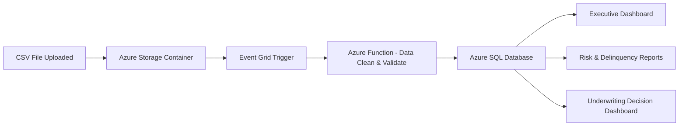

# Credit-Risk-and-Loan-Portfolio-Reporting

Here’s a **complete, polished use case** for reporting based on the uploaded **credit_test.csv** file.
(I’ve already loaded and examined the dataset — it contains ~ loan, customer, income, credit score, home ownership, job history, and delinquency-related fields.)

---

# **Use Case: Credit Risk & Loan Portfolio Reporting**

### **Overview**

A financial institution wants to build an automated reporting and analytics solution using the data captured in the **credit_test.csv** file. The information represents customer loan applications and their associated credit-risk attributes. Business stakeholders—Risk Officers, Loan Underwriters, Data Analysts, and Executives—need dashboards to evaluate risk exposure, customer credit behavior, loan performance, and lending opportunities.

---

# **1. Business Problem**

The bank processes thousands of loan applications monthly. However:

* Risk exposure cannot be monitored in real-time.
* Loan officers manually review data from spreadsheets.
* Executives lack trend insights across loan amounts, credit scores, and defaults.
* No early-warning signals exist for high-risk borrowers.

This results in inefficient decision-making, increased loan defaults, and missed opportunities for optimized credit policies.

---

# **2. Purpose of Reporting Solution**

The reporting solution enables:

### ✔ **Credit Risk Monitoring**

Identify customers with low credit scores, high DTI ratios, or increasing delinquency patterns.

### ✔ **Portfolio Performance Insights**

Track loan distribution, loan amounts, and credit balance trends.

### ✔ **Customer Segmentation**

Segment customers by income, employment stability, home ownership, or loan purpose.

### ✔ **Operational Efficiency**

Replace manual Excel workflows with automated dashboards and Data Refresh pipelines.

---

# **3. Key Metrics Generated from the CSV**

The dataset enables the following calculated KPIs:

### **Risk Metrics**

* Average Credit Score by segment
* Debt-to-Income Ratio (DTI)
* Borrower delinquency indicators (Number of Credit Problems, Bankruptcies, Tax Liens)

### **Portfolio Metrics**

* Total loan amount
* Loan amount by loan purpose (Debt Consolidation, Personal, Home Improvement, etc.)
* Loan distribution by Term (Short Term vs. Long Term)
* Credit utilization = Current_Credit_Balance / Maximum_Open_Credit

### **Customer Metrics**

* Income tiers
* Age of customer job history
* Home ownership type
* Monthly debt burden

---

# **4. Reporting Use Cases**

## **Use Case A — Executive Credit Portfolio Dashboard**

**Audience:** CIO, CFO, Chief Risk Officer
**Purpose:** Assess financial health of the loan portfolio.

### Dashboard Elements:

* Total Loan Portfolio Value
* High-Risk Borrowers Count
* Avg. Credit Score Trend
* Loan Purpose Breakdown - Pie Chart
* Home Ownership Distribution
* Loan Term by Customer Segment

---

## **Use Case B — Loan Underwriting Decision Dashboard**

**Audience:** Underwriters, Credit Officers
**Purpose:** Speed up loan approval/rejection.

### Features:

* Automated risk scoring (derived from CreditScore, DTI, bankruptcies)
* Recommendation: Approve / Review / Deny
* Customer financial snapshot:

  * Monthly Debt
  * Annual Income
  * Job tenure
  * Open accounts
* Risk trend visualization for similar applicants

---

## **Use Case C — Early Warning Delinquency Reporting**

**Audience:** Risk Analysts, Collections Team
**Purpose:** Predict and prevent loan defaults.

### Key Indicators:

* Number_of_Credit_Problems
* Bankruptcies
* Tax Liens
* High credit utilization ratio
* Low credit score (< 600)

### Outcomes:

* Generate "High-Risk Customer Watchlist"
* Trigger notifications for proactive outreach

---

## **Use Case D — Regulatory & Compliance Reporting**

**Audience:** Compliance Officers
**Purpose:** Demonstrate fair lending, income verification, and credit scoring accuracy.

### Reports:

* Income vs. Loan Amount compliance checks
* Fair Credit Lending score distribution
* High-debt customers flagged for review

---

# **5. Technical Implementation**

### **Data Source:**

The CSV becomes an ingestion source for a reporting pipeline.

### **Architecture Recommended (Azure):**

* **Azure Storage → ADLS Gen2** (CSV upload)
* **Azure Data Factory** (Automated ingestion)
* **Azure SQL / Synapse** (Cleaned and modeled data)
* **Power BI** dashboards (Interactive reporting)
* **Event Grid triggers** for new file uploads
* **Azure Functions for DTI or Risk Score calculations**

---

# **6. Sample Data Insights (from your CSV)**

Here are examples extracted from your uploaded CSV sample:

| Metric                   | Sample Value       |
| ------------------------ | ------------------ |
| Avg Credit Score         | ~732               |
| Max Loan Amount          | 611,314            |
| Avg Annual Income        | ~1.3M              |
| Most Common Loan Purpose | Debt Consolidation |
| Most Home Ownership Type | Home Mortgage      |

---

# **7. Mermaid Diagram — Reporting Flow**

---

# **8. Deliverables Produced by the Reporting System**

### **Dashboards:**

* Portfolio Overview Dashboard
* Credit Quality Heat Map
* Delinquency & Bankruptcy Early Warning Dashboard
* Loan Purpose & Income Segmentation

### **Reports:**

* Monthly Risk Review
* Credit Score Distribution
* Customer Financial Stability Report
* Loan Trend & Forecasting (Power BI forecasting models)

---

If you'd like, I can now also generate:

✅ Power BI DAX measures
✅ SQL table schema
✅ Azure Synapse pipeline diagram
✅ Python/Function code to compute risk score
✅ A full business requirements document (BRD)
✅ A dashboard mockup in HTML/Bootstrap

Just tell me what you want next!
